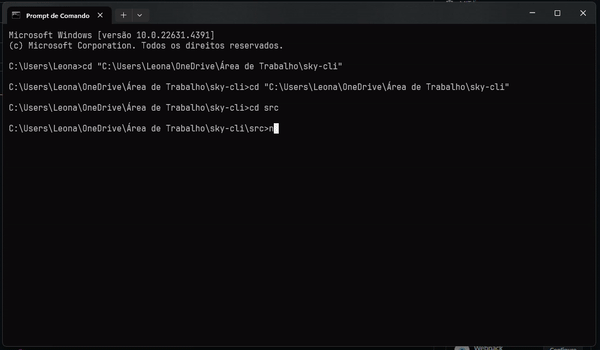

# sky-cli
Sky CLI is a powerful and versatile command-line interface designed for developers who need to streamline their workflow. It provides a comprehensive suite of tools for managing APIs, handling file operations, manipulating data, and using templates to simplify repetitive tasks. Whether you’re automating file operations, making API requests, or processing data, sky-cli has you covered!

## Table of Contents
1. [Quick Overview](#-Quick-Overview)
2. [Features](#-features)
    - [File Management](#file-management)
    - [API Interaction](#api-interaction)
    - [Data Manipulation](#data-manipulation)
    - [Template Creation](#template-creation)
3. [How to Install the CLI](#how-to-install-the-cli)
4. [How to Use the CLI](#how-to-use-the-cli)
5. [Project Structure](#project-structure)

## Quick Overview:



---
### 🚀 Features
1. #### File Management
    - **File and Folder Listing:** Interactively list files and directories with filters for file type, size, or creation date.

    - **File Operations:** Move, copy, rename, and delete files or directories. An interactive mode confirms potentially destructive actions (like deletions).

    - **Advanced Search:** Search inside files using regular expressions or by metadata such as creation or modification date.
    
    - **File Comparison:** Compare the contents of two files, useful for developers needing to track changes between file versions.

2. #### API Interaction
    - **HTTP Requests:** Perform HTTP requests (GET, POST, PUT, DELETE) with support for custom headers, authentication, and JSON payloads.

    - **API Monitoring:** Periodically ping API endpoints to track status, response times, and potential errors.

    - **API Logs:** Store and view logs of previous API requests for debugging and analysis.

3. #### Data Manipulation
    - **Format Conversion:** Convert between data formats like JSON, XML, and CSV.

4. #### Template Creation
    - **Project Structure Generation:** Quickly generate project structures for popular frameworks or libraries with initial files (e.g., index.js, package.json).
    - **Custom Templates:** Create and store personalized templates to speed up project generation.
    - **Configurable Templates:** Customize templates during creation, such as including/excluding dependencies or configuring linters and test environments.

## How to install the CLI
**Step 1:** Clone this repository
```
git clone https://github.com/LeonardoEnnes/sky-cli.git
```

**Step 2:** Install the dependencies
```
npm install
```

## How to use the CLI

**Step 1:** Go to the repository folder, open the terminal, and navigate to the src folder.
```
cd src
```

**Step 2:** Write this command to start the CLI:
```
node index.js
```

**Step 3:** Select a command from the list. You will be prompted with an autocomplete list of commands. Start typing the command you want to execute and select it from the list. <br> 

#### The available commands are:
- help
- create-template
- request
- monitor
- logs
- read-file
- write-file
- delete-file
- list-files
- compare-files
- search
- convert-format

<br>

**Step 4:** If you need instructions on how to use certain commands, we recommend using the **help** command. This command will provide you with instructions on how to properly use the other commands.

## Project Structure
Here is the structure of the **sky-cli** project:

```
sky-cli/
├── src/
│   ├── index.js                # Main entry point for the CLI
│   ├── utils/                  # Utility functions and classes
│   │   ├── api.js              # API interaction and logging
│   │   ├── cli.js              # CLI command handling
│   │   ├── fileManager.js       # File operations management
│   │   ├── formatConverter.js    # Data format conversion
│   │   ├── init.js              # Initialization and welcome message
│   │   ├── log.js               # Logging utility
│   │   ├── search.js            # File searching functionality
│   │   └── templateManager.js    # Template management
│   └── templates/               # Directory for storing templates
│       ├── landing-page-template.json  # JSON template for landing page
│       ├── feature-toggle-template.json # JSON template for feature toggles
│       └── ...                  # Other templates
├── package.json                 # Project metadata and dependencies
└── README.md                    # Project documentation
```
